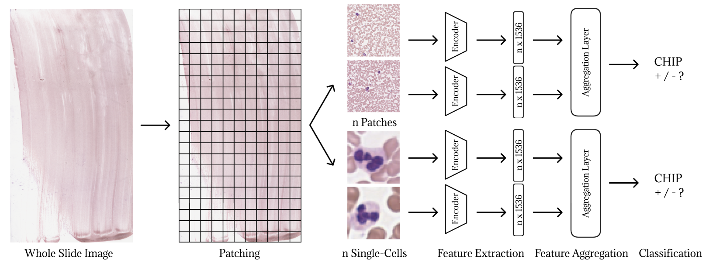

# CHIP Detection in Peripheral Blood and Bone Marrow Smears

This repository contains the code for detecting CHIP (Clonal Hematopoiesis of Indeterminate Potential) in peripheral blood (PB) and bone marrow (BM) smears. Two alternative approaches are implemented: a **patch-based** approach and a **single-cell-based** approach.

## Pipeline Overview

**Figure 1**: Overview of the analytical pipeline. Beginning with BM or PB whole slide images, the
process initiates with patching. Subsequently, two alternative paths are undertaken: direct utilization of PB
or BM patches in the patch-based approach or segmentation of PB patches for the single-cell analysis. Finally,
feature extraction is performed using UNI2 and DinoBloom-G, followed by feature aggregation through AB-
MIL and TransMIL deep learning models for the final classification of CHIP.

### 1. Quality Control (PB Slides)
Each 224×224 tile undergoes a preprocessing step to assess its quality. Tiles with excessive or insufficient cellular density and/or poor resolution are discarded. **Code**: `quality_control/quality_control.py`

### 2. White Blood Cell Segmentation (Single-Cell-Based)
Each white blood cell is segmented into 40×40 single-cell patches using a neural cellular automata approach. **Code**: `segmentation/nca_segment.py`

### 3. Feature Extraction
Features are extracted from the images, either from: 224×224 patches (patch-based), or 40×40 single-cell patches (single-cell-based).

Two encoders are available:
- **DinoBloom-G**: `feature_extraction/fe_dinobloom-g.py`
- **UNI2**: `feature_extraction/fe_uni2.py`

### 4. K-Fold Cross-Validation
CSV files are generated to perform case-wise k-fold cross-validation, scripts can be found in the `datasets/` folder.

1. `generate_csv_chipai.py`: generates a CSV with slide ID, label, and tile path.
2. `generate_csv_data_sample.py`: extracts patient ID, label, and sample number from `.h5` files resulting from feature extraction and stores the information in a CSV.
3. `kfold_splits_patient.py`: performs case-wise stratified k-fold cross-validation and assigns `train`, `val`, and `test` splits.

### 5. Feature Aggregation and Model Training
Model training is performed using: `feature_aggregation/train_kfold.py`

For model testing, use one of the following depending on the agregation model:
  - **AB-MIL**: `feature_aggregation/test_kfold_AB-MIL.py`
  - **TransMIL**: `feature_aggregation/test_kfold_transMIL.py`

## Model Weights
The repository includes pretrained model weights for quality control and white blood cell segmentation. The pretrained networks for feature extraction can be downloaded from [UNI](https://github.com/mahmoodlab/UNI) and from [DinoBloom](https://github.com/marrlab/DinoBloom).

## Requirements
Please refer to the corresponding `requirements.txt` located inside each folder for software dependencies and environment setup.

---
